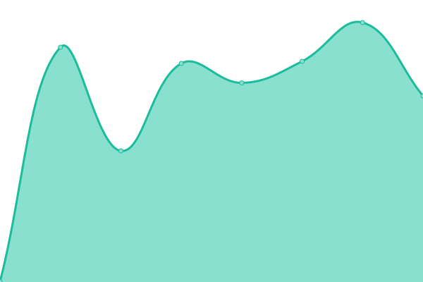
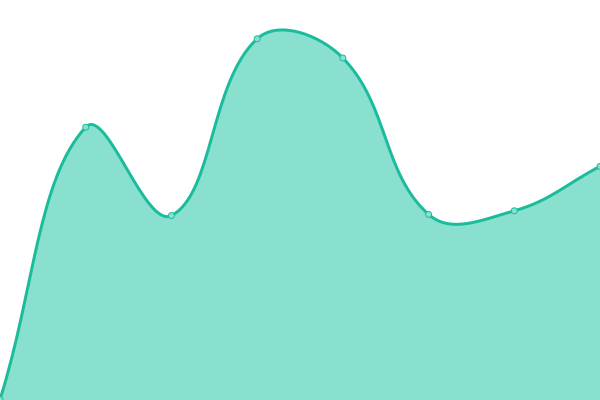
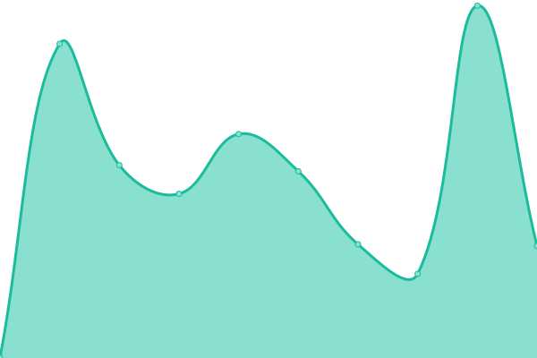
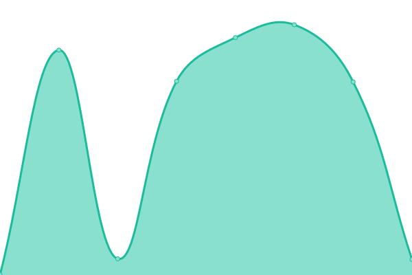
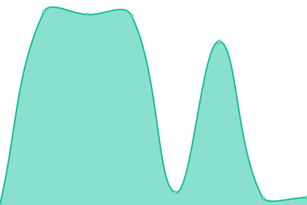
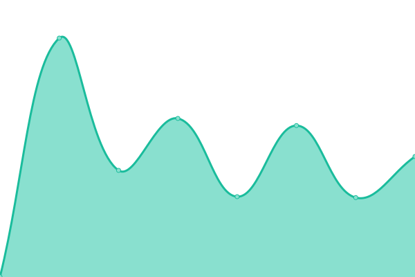
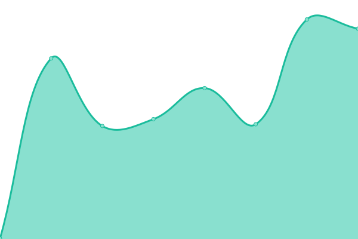

# [📈 Live Status](https://vichaos.github.io/upptime): <!--live status--> **🟩 All systems operational**

This repository contains the open-source uptime monitor and status page for [Upptime](https://upptime.js.org), powered by [Upptime](https://github.com/upptime/upptime).

With [Upptime](https://upptime.js.org), you can get your own unlimited and free uptime monitor and status page, powered entirely by a GitHub repository. We use [Issues](https://github.com/upptime/upptime/issues) as incident reports, [Actions](https://github.com/vichaos/upptime/actions) as uptime monitors, and [Pages](https://upptime.github.io/upptime) for the status page.

<!--start: status pages-->
<!-- This summary is generated by Upptime (https://github.com/upptime/upptime) -->
<!-- Do not edit this manually, your changes will be overwritten -->
<!-- prettier-ignore -->
| URL | Status | History | Response Time | Uptime |
| --- | ------ | ------- | ------------- | ------ |
|  [Sentry](https://sentry9-th.line-apps.com/_health/) | 🟩 Up | [sentry.yml](https://github.com/vichaos/upptime/commits/HEAD/history/sentry.yml) | 

 575ms
     
 | 

<a href="https://vichaos.github.io/upptime/history/sentry">99.95%</a>
    

|  [OAplus](https://oaplus.line.biz/health) | 🟩 Up | [o-aplus.yml](https://github.com/vichaos/upptime/commits/HEAD/history/o-aplus.yml) | 

 581ms
     
 | 

<a href="https://vichaos.github.io/upptime/history/o-aplus">100.00%</a>
    

|  [OAplus - Developers](https://developers-oaplus.line.biz/) | 🟩 Up | [o-aplus-developers.yml](https://github.com/vichaos/upptime/commits/HEAD/history/o-aplus-developers.yml) | 

 613ms
     
 | 

<a href="https://vichaos.github.io/upptime/history/o-aplus-developers">100.00%</a>
    

|  [OA Plus - LIFF](https://web-api-oaplus.line.me) | 🟩 Up | [oa-plus-liff.yml](https://github.com/vichaos/upptime/commits/HEAD/history/oa-plus-liff.yml) | 

 599ms
     
 | 

<a href="https://vichaos.github.io/upptime/history/oa-plus-liff">100.00%</a>
    

|  [OA Plus - mobile API](https://api-oaplus-mobile.line-apps.com/account/v1/accounts) | 🟩 Up | [oa-plus-mobile-api.yml](https://github.com/vichaos/upptime/commits/HEAD/history/oa-plus-mobile-api.yml) | 

 582ms
     
 | 

<a href="https://vichaos.github.io/upptime/history/oa-plus-mobile-api">100.00%</a>
    

|  [OA Plus - partner API](https://api-oaplus-partner.line-apps.com/v1/jwks/jwks.json) | 🟩 Up | [oa-plus-partner-api.yml](https://github.com/vichaos/upptime/commits/HEAD/history/oa-plus-partner-api.yml) | 

 604ms
     
 | 

<a href="https://vichaos.github.io/upptime/history/oa-plus-partner-api">100.00%</a>
    

|  [SC](https://shop.line.me/) | 🟩 Up | [sc.yml](https://github.com/vichaos/upptime/commits/HEAD/history/sc.yml) | 

 1160ms
     
 | 

<a href="https://vichaos.github.io/upptime/history/sc">99.99%</a>
    

|  [SC storefront productend](https://shop.line.me/@024azltq/product/319384970) | 🟩 Up | [sc-storefront-productend.yml](https://github.com/vichaos/upptime/commits/HEAD/history/sc-storefront-productend.yml) | 

 410ms
     
 | 

<a href="https://vichaos.github.io/upptime/history/sc-storefront-productend">99.99%</a>
    

|  [SC storefront shopend](https://shop.line.me/@024azltq) | 🟩 Up | [sc-storefront-shopend.yml](https://github.com/vichaos/upptime/commits/HEAD/history/sc-storefront-shopend.yml) | 

 403ms
     
 | 

<a href="https://vichaos.github.io/upptime/history/sc-storefront-shopend">100.00%</a>
    

|  [MyShop API with Authorization Header](https://developers-oaplus.line.biz/myshop/api/health) | 🟩 Up | [my-shop-api-with-authorization-header.yml](https://github.com/vichaos/upptime/commits/HEAD/history/my-shop-api-with-authorization-header.yml) | 

 434ms
     
 | 

<a href="https://vichaos.github.io/upptime/history/my-shop-api-with-authorization-header">100.00%</a>
    

|  [Horoscope](https://horoscope.line.me) | 🟩 Up | [horoscope.yml](https://github.com/vichaos/upptime/commits/HEAD/history/horoscope.yml) | 

 607ms
     
 | 

<a href="https://vichaos.github.io/upptime/history/horoscope">100.00%</a>
    

|  [TodayShowcase](https://todayshowcase.line.me) | 🟩 Up | [today-showcase.yml](https://github.com/vichaos/upptime/commits/HEAD/history/today-showcase.yml) | 

 1042ms
     
 | 

<a href="https://vichaos.github.io/upptime/history/today-showcase">100.00%</a>
    

|  [Melody](https://melody.line.me) | 🟩 Up | [melody.yml](https://github.com/vichaos/upptime/commits/HEAD/history/melody.yml) | 

 565ms
     
 | 

<a href="https://vichaos.github.io/upptime/history/melody">100.00%</a>
    

|  [Sticker Channel API](https://sticker-channel-api.line.me/monitor/l7check) | 🟩 Up | [sticker-channel-api.yml](https://github.com/vichaos/upptime/commits/HEAD/history/sticker-channel-api.yml) | 

 559ms
     
 | 

<a href="https://vichaos.github.io/upptime/history/sticker-channel-api">100.00%</a>
    

<!--end: status pages-->

[**Visit our status website →**](https://vichaos.github.io/upptime)

## 📄 License

- Powered by: [Upptime](https://github.com/upptime/upptime)
- Code: [MIT](./LICENSE) © [Upptime](https://upptime.js.org)
- Data in the `./history` directory: [Open Database License](https://opendatacommons.org/licenses/odbl/1-0/)
